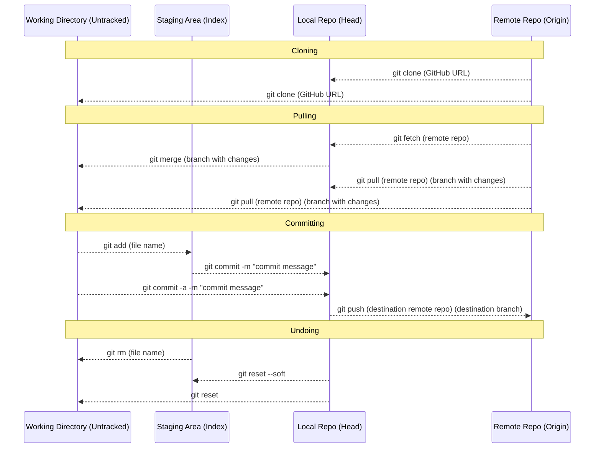

These are common Git commands used in various situations:

start a working area (see also: git help tutorial)
clone     Clone a repository into a new directory
init      Create an empty Git repository or reinitialize an existing one

work on the current change (see also: git help everyday)
add       Add file contents to the index
mv        Move or rename a file, a directory, or a symlink
restore   Restore working tree files
rm        Remove files from the working tree and from the index

examine the history and state (see also: git help revisions)
bisect    Use binary search to find the commit that introduced a bug
diff      Show changes between commits, commit and working tree, etc
grep      Print lines matching a pattern
log       Show commit logs
show      Show various types of objects
status    Show the working tree status

grow, mark and tweak your common history
branch    List, create, or delete branches
commit    Record changes to the repository
merge     Join two or more development histories together
rebase    Reapply commits on top of another base tip
reset     Reset current HEAD to the specified state
switch    Switch branches
tag       Create, list, delete or verify a tag object signed with GPG

collaborate (see also: git help workflows)
fetch     Download objects and refs from another repository
pull      Fetch from and integrate with another repository or a local branch
push      Update remote refs along with associated objects

if you need anything specific, git help (command) is used to help with specific commands.
