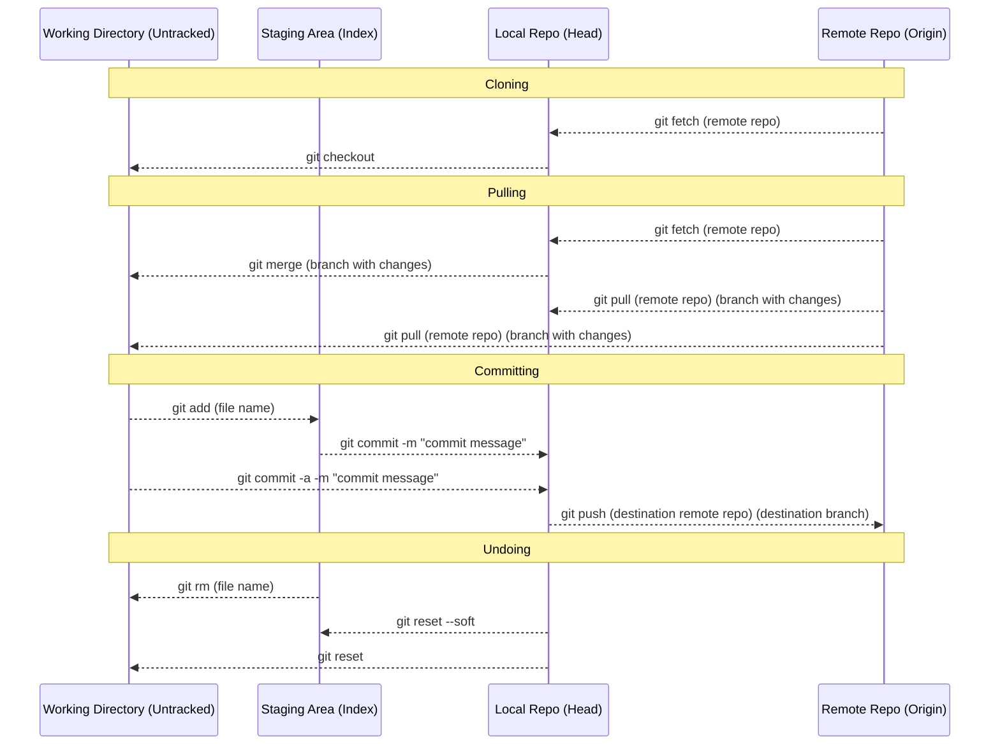

# How to Git

- [Architecture](#git-commands-architecture)
- [Intro](#intro)
- [Installing Git](#installing-git)
- [Git commands](#git-commands)
- [Useful parameters for popular commands](#useful-parameters-for-popular-commands)

### Git Commands Architecture



## Intro

Git is a distributed version control system that is widely used for tracking changes in source code during software development. It allows multiple developers to collaborate on a project simultaneously and efficiently manage different versions of their code.

You can find a very fun overview [here](https://rogerdudler.github.io/git-guide/)

## Installing Git

For macOS, you will need a package manager installed, e.g. Homebrew.
After Homebrew is installed, just run this command:

```bash
brew install git
```

## Git commands

Further instructions can be found in `git help`, or `git help <COMMAND>` to specify what command you want help with.
(It can be a bit convoluted though).

These are common Git commands used in various situations:

- start a working area (see also: git help tutorial)

  - clone --- Clone a repository into a new directory
  - init --- Create an empty Git repository or reinitialize an existing one

- work on the current change (see also: git help everyday)

  - add --- Add file contents to the index
  - mv --- Move or rename a file, a directory, or a symlink
  - restore --- Restore working tree files
  - rm --- Remove files from the working tree and from the index

- examine the history and state (see also: git help revisions)

  - bisect --- Use binary search to find the commit that introduced a bug
  - diff --- Show changes between commits, commit and working tree, etc
  - grep --- Print lines matching a pattern
  - log --- Show commit logs
  - show --- Show various types of objects
  - status --- Show the working tree status

- grow, mark and tweak your common history

  - branch --- List, create, or delete branches
  - commit --- Record changes to the repository
  - merge --- Join two or more development histories together
  - rebase --- eapply commits on top of another base tip
  - reset --- Reset current HEAD to the specified state
  - revert --- Does the opposite of a specific commit
  - switch --- Switch branches
  - tag --- Create, list, delete or verify a tag object signed with GPG

- collaborate (see also: git help workflows)

  - fetch --- Download objects and refs from another repository
  - pull --- Fetch from and integrate with another repository or a local branch
  - push --- Update remote refs along with associated objects

If you need anything specific, git help (command) is used to help with specific commands.

## Useful parameters for popular commands

### clone:

`git clone <repository>`

- `<repository>` can be replaced with the remote repo URL if it was created on another machine or the local repo directory that was initalised on your machine.

### add:

`git add -i <filename>`

- `-i` gives more adding options
- `<filename>` can be replaced with the filename directory that can be found with `git diff` or `git status`, or a `.` if you want to all the modified files to the staging area.

### commit:

`git commit -a -m "<msg>"`

- `-a` (optional) is basically combining `git add` and `git commit` into one fell swoop, mainly used for single file commits.
- `-m "<msg>"` is used to write the commit message in the command itself, just replace `<msg>` with your commit message. If this is not included it brings you to the commit message UI (more difficult).

### push:

`git push <remote-repo> <destination-branch>`

- `<remote-repo>` is the remote repository (origin) you want to push your changes on you local repo (HEAD) to.
- `<destination-branch>` is the remote branch you want to push your changes on you local branch to.

### checkout:

`git checkout -b <branch-name>`

- `-b` (optional) is used to create a new branch in the local repo while switching to it. You will need to state the branch name in this case.
- `<branch-name>` (optional) is used to specify which branch you'd like to switch to. If this omitted, it will switch to your most recent branch you are no longer on.

### branch:

`git branch [-d|-D|-a]`

- `-d|-D <branch-to-delete>` deletes or force deletes a specified branch.
- `-a` shows all of the branches, local and remote.

### fetch:

`git fetch -v <remote-repo> <remote-branch>`

- `-v` (optional) shows what is happening in the fetch
- `<remote-repo>` (optional) specifies the remote repo to fetch changes from, default if not specified.
- `<remote-branch>` (optional) specifies remote branch to pull changes from, all branches if not specified.

### pull:

`git pull --<options> <remote-repo> <remote-branch>`

- `--<options>` (optional) defines how you want to pull. Replace `--<options>` with one of the following:
  - `-r|--rebase` applies your local commits to current branch as well as fetched changes from remote repo (origin).
  - `--no-rebase` only pulls the changes from remote (origin).
  - `--ff-only` pulls only if a fast-forward (merging where at least one branch no new commits) can be done.
- `<remote-repo>` (optional) specifies the remote repo to fetch changes from, default if not specified.
- `<remote-branch>` (optional) specifies remote branch to pull changes from, current branch if not specified.

### log:

`git log --pretty=oneline`
- sets up a nice list of remote branch merges
OR
`git log --graph --oneline --decorate --all`
- sets up a tree graph of remote branch merges
